# Award-Winning Product, UX, Diagrams, Data Visualization, and Delivery Strategy

## 1. Product Vision
A browser-first 31-EDO SATB workspace that unifies composition, correction, generation, and pedagogy:
- spelling-preserving 31-EDO editing;
- deterministic harmony/counterpoint/voice-leading diagnostics;
- explainable four-voice generation;
- beginner/pro educational explanation layer;
- versioned, research-friendly rule-pack platform.

## 2. User Personas and Jobs To Be Done
- **Learner**: goal improve exercises; pain opaque mistakes; input homework score; output corrections + explanations; success reduced repeat errors; risk over-warning.
- **Composer**: goal generate alternatives quickly; pain weak voicing options; input melody/bass; output ranked candidates; success accepted candidate <2 min; risk style mismatch.
- **Teacher**: goal review objectively; pain inconsistent marking; input student files; output rubric-aligned diagnostics; success reproducible reports; risk false positives.
- **Researcher**: goal compare rule systems; pain hidden assumptions; input rule profiles; output analyzable traces; success reproducible experiments; risk invalid corpus claims.
- **Rule-pack author**: goal encode style safely; pain version drift; input pack schema; output signed pack; success zero schema regressions; risk unsourced authority.
- **OSS maintainer**: goal safe dependency updates; pain license/security churn; input release advisories; output audited updates; success no license break; risk accidental copyleft contamination.

## 3. Business Process Mapping
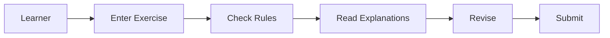
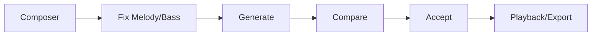
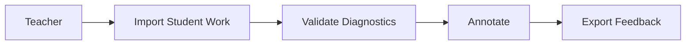
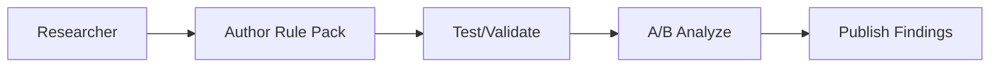
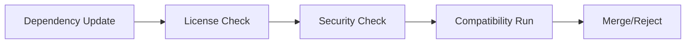

## 4. End-to-End Functional Flow
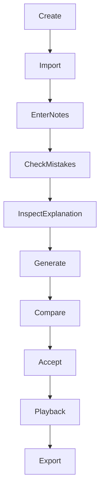
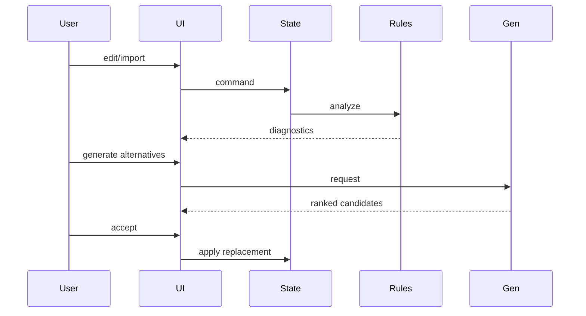

## 5. Functional Block Diagrams
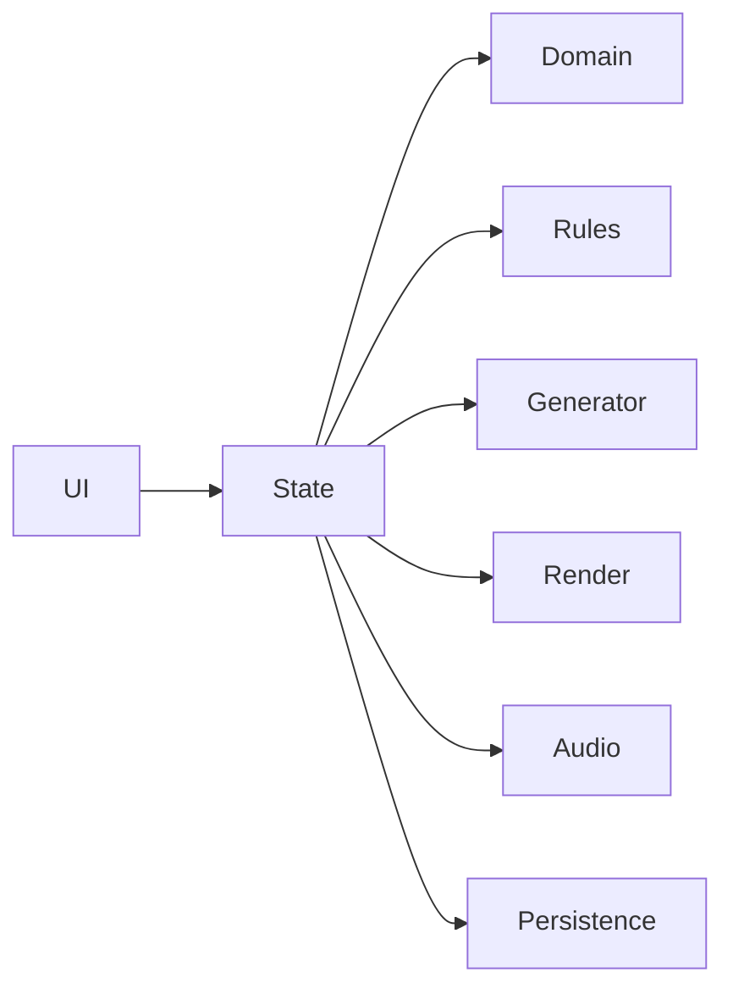
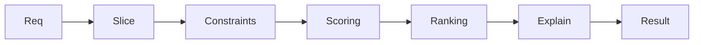
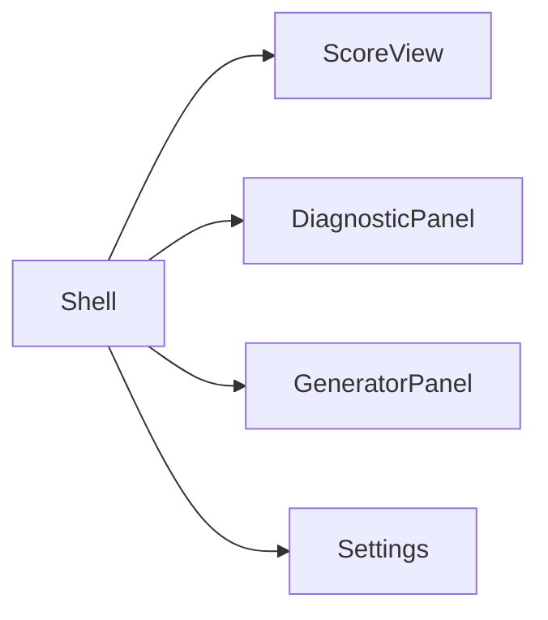
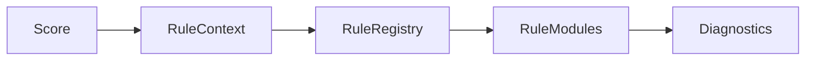
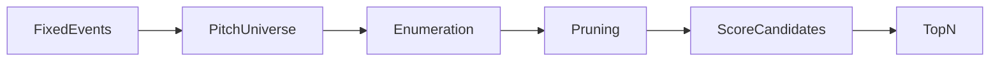
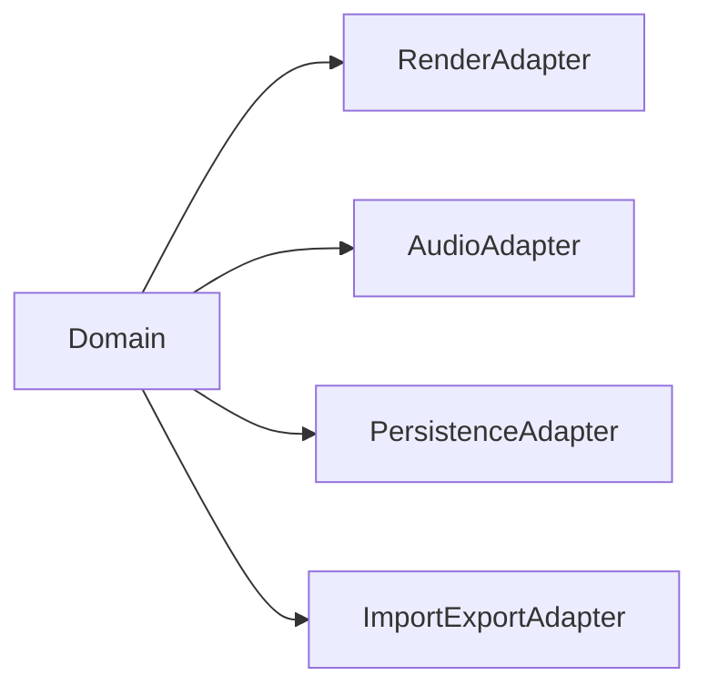

## 6. Activity Diagrams
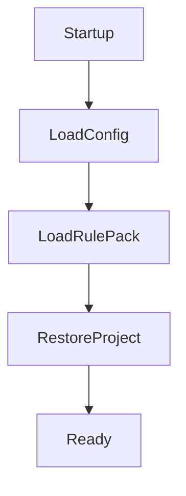
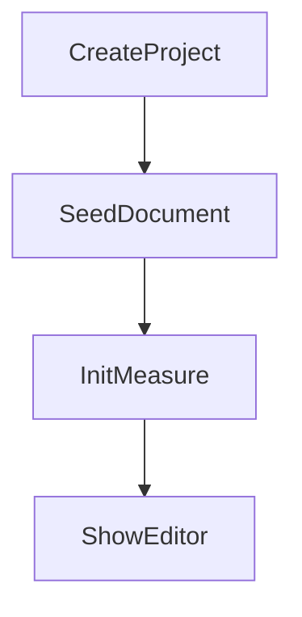
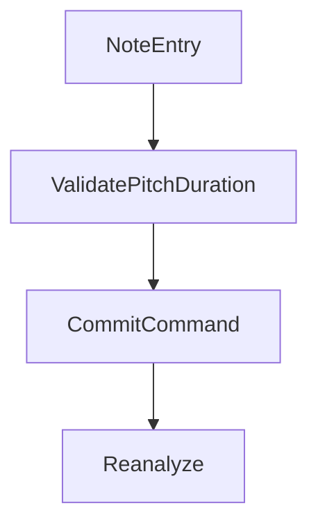
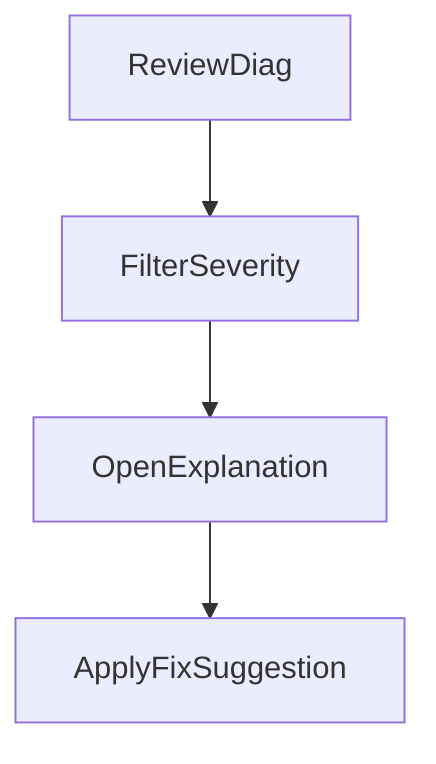
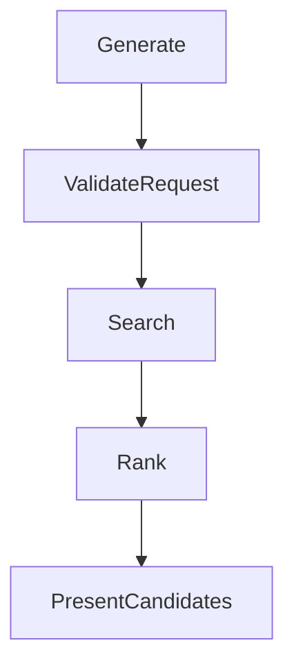
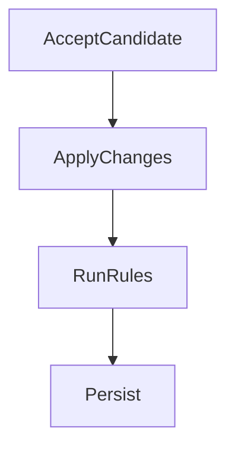
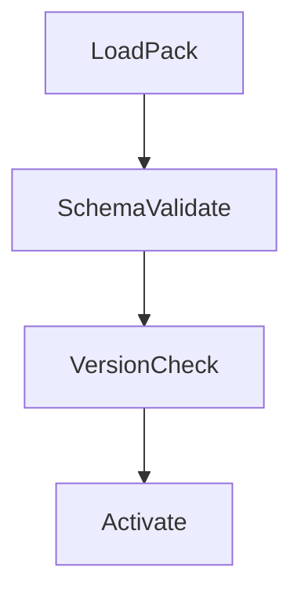
```mermaid
flowchart TD
 ImportExport-->ParseSerialize-->Validate-->MapDomain
```
```mermaid
flowchart TD
 Playback-->BuildPlaybackEvents-->Schedule-->StopResume
```
```mermaid
flowchart TD
 Error-->Classify-->UserMessage-->RecoveryAction
```

## 7. Data-Flow Diagrams
```mermaid
flowchart LR
 User-->App
 App-->ProjectStore
 App-->RulePackStore
 App-->ExportFiles
```
```mermaid
flowchart LR
 ProjectDoc-->ContextBuilder-->RuleEngine-->Generator-->DiagnosticsStore-->UI
```
```mermaid
flowchart LR
 ScoreSlice-->RuleModules-->Violations-->DiagnosticRanker-->Explanations
```
```mermaid
flowchart LR
 GenerationRequest-->SearchNodes-->HardPruner-->SoftScorer-->Candidates
```
```mermaid
flowchart LR
 UIActions-->CommandBus-->StateReducer-->RenderModel
```
```mermaid
flowchart LR
 ImportFile-->Parser-->SchemaValidation-->ProjectDocument-->Exporter-->OutputFile
```
```mermaid
flowchart LR
 RuntimeEvents-->TelemetryAggregator-->PrivacyFilter-->MetricsStore
```
Entities: user, teacher tools, filesystem. Stores: project, rule packs, metrics. Validation: parser/schema/rule-pack. Trust boundaries: imported files and optional network update endpoints.

## 8. Dataflow Architecture
```mermaid
erDiagram
 PROJECT_DOCUMENT ||--o{ SCORE : contains
 SCORE ||--o{ MEASURE : contains
 MEASURE ||--o{ SCORE_EVENT : contains
 SCORE_EVENT }o--|| SPELLED_PITCH31 : references
 RULE_CONTEXT ||--o{ DIAGNOSTIC : emits
 GENERATION_REQUEST ||--o{ GENERATION_CANDIDATE : produces
 GENERATION_CANDIDATE ||--|| CANDIDATE_SCORE : has
```
```mermaid
stateDiagram-v2
 [*]-->Clean
 Clean-->Dirty: edit/import
 Dirty-->Analyzed: run checks
 Analyzed-->Generated: request generation
 Generated-->Accepted: apply candidate
 Accepted-->Clean: save
```

## 9. Data and Information Visualization Design
- 31-EDO lattice: purpose pitch semantics; encoding letter/accidental/step; keyboard+hover details; WCAG contrast + symbol redundancy.
- SATB grid/staff: events by voice/time; drag/edit and keyboard step entry; focus order and aria labels.
- Diagnostic overlay + heatmap: severity by color+shape; click opens explanation card.
- Voice-leading arrows: between slices; shows motion type.
- Candidate dashboard: score table + violations badges + before/after diff.
- Rule trace tree: rule → evidence → location.
- Search telemetry: nodes visited, prune rates, timeout markers.
Implementation: `src/ui/*`, `src/render/*`, `src/diagnostics/*`, `src/generator/*`.

## 10. Flow Process Charts
| step | actor | operation | input | transformation | output | validation | source files | metrics | risks |
|---|---|---|---|---|---|---|---|---|---|
| note entry | user/system | insert note | key/click | parse+command | ScoreEvent | pitch/duration | `src/domain/pitch/*`, `src/state/*` | edit latency | invalid accidental |
| mistake detection | system | analyze | Score | slices+rules | Diagnostic[] | deterministic sort | `src/theory/sonority/*`, `src/rules/*` | diagnostics/run | false positives |
| explanation generation | system | map violation | Diagnostic | template fill | Explanation | required fields | `src/explanations/*` | open rate | ambiguity |
| four-voice generation | system | search | GenerationRequest | enumerate/prune/score | Candidates | maxNodes/timeout | `src/generator/*` | candidate yield | combinatorial blowup |
| candidate comparison | user | inspect | Candidate set | table/rank | accepted id | candidate integrity | `src/ui/generator/*` | acceptance rate | overload |
| playback | system | schedule | Score | pitch->hz events | audio events | timing bounds | `src/audio/*` | playback usage | drift |
| import/export | user/system | parse/serialize | file/doc | map schema | ProjectDocument/file | schema version | `src/importExport/*` | error count | data loss |
| rule-pack authoring | researcher | edit pack | YAML/JSON | schema + version | RulePack | signature/schema | `src/rules/packs/*` | pack validity | unsourced rules |
| OSS integration | maintainer | update dep | advisories | license/security checks | merge/reject | legal matrix | `docs/*`, scripts | upgrade lead time | license conflict |

## 11. Full Proposed File Structure
`src/domain`, `src/theory`, `src/rules`, `src/analysis`, `src/generator`, `src/diagnostics`, `src/explanations`, `src/state`, `src/ui`, `src/render`, `src/audio`, `src/persistence`, `src/importExport`, `src/workers`, plus `docs`, `tests`, `fixtures`.
For each file class:
- role: contract, algorithm, adapter, or presentation;
- exports: typed interfaces/functions;
- linked diagrams: sections 4–8;
- linked tests: unit/integration/property/golden;
- linked UX flows: sections 9–10.

## 12. Algorithm and Feature Cards
Each algorithm uses: purpose, I/O contract, invariants, pre/post, pseudo-code, complexity, edge cases, tests, failure modes, traceability.
- pitch parsing, spelling normalization, interval math, sonority slicing, rule detection, diagnostic ranking, generator search, candidate scoring, explanation generation, playback scheduling, render model creation, import/export validation.
Pseudo-code standard:
1. validate input
2. transform deterministically
3. enforce hard invariants
4. emit typed result + trace metadata

## 13. Open-Source Functionality Clone/Reuse Plan
- VexFlow/OSMD/Verovio: rendering and MusicXML behavior study only unless compatible dependency integration; no direct code copying.
- Tone.js: scheduling boundary patterns (MIT).
- music21: theory abstraction/test ideas (BSD), reimplemented in TS.
- Tonal.js: functional API style only; avoid 12-ET assumptions.
- MuseScore/LilyPond: UX/workflow inspiration only (GPL caution).
Always maintain license matrix + attribution + fallback replacement plan.

## 14. UX Quality Bar
Clarity, low cognitive load, educational explanations, consistent hierarchy, keyboard-first editing, full explainability, WCAG AA+, <50ms interaction feedback on medium scores, robust error recovery, i18n-ready copy, beginner/pro modes.

## 15. Engineering Delivery Strategy
Phases: architecture prototype → domain core → rules → generator → notation/playback → UX visualization → import/export → workerization/perf → public beta → rule-pack research.
Each phase requires passing typecheck/lint/test/build, updated docs/traceability, and acceptance fixtures.

## 16. Metrics and Telemetry
Collect privacy-preserving aggregate metrics only: generation success %, diagnostic frequency by rule id, candidate acceptance %, playback usage counts, import/export error codes, latency timings, accessibility audit pass rates. No score content uploaded by default.

## 17. Risk Register
Theory correctness, 12-ET leakage, spelling collapse, OSS license risk, UI complexity, performance cliffs, data loss, rule-pack authority drift, pedagogical overclaiming.

## 18. Traceability Matrix
Feature → persona need → data model → algorithm → diagram → file(s) → tests → risks → acceptance criterion (maintained in docs traceability index).

## 19. Final Acceptance Checklist
- [x] Requested diagram families included.
- [x] Major file architecture specified.
- [x] Product-critical algorithms covered.
- [x] UX and engineering strategy aligned.
- [x] OSS strategy legally cautious.
- [x] 31-EDO spelling identity preserved.
- [x] New-project orientation maintained.

## Command Checklist
- `npm run typecheck`
- `npm run lint`
- `npm test`
- `npm run build`
