# Four-Voice 31-EDO Harmony Generator and Search Pipeline

## File structure
- `src/generator/GenerationRequest.ts`
- `src/generator/GenerationResult.ts`
- `src/generator/GenerationCandidate.ts`
- `src/generator/SearchNode.ts`
- `src/generator/CandidateScore.ts`
- `src/generator/GeneratorConfig.ts`
- `src/generator/constraints/hardConstraints.ts`
- `src/generator/scoring/scoreCandidate.ts`
- `src/generator/search/generateFourVoiceHarmony.ts`
- `src/generator/explain/explainCandidate.ts`
- `src/test/generator-search.test.ts`

## Functional block diagram
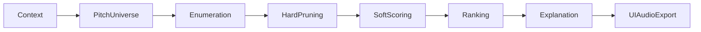
## Functional flow
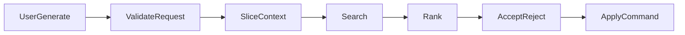
## Activity diagrams
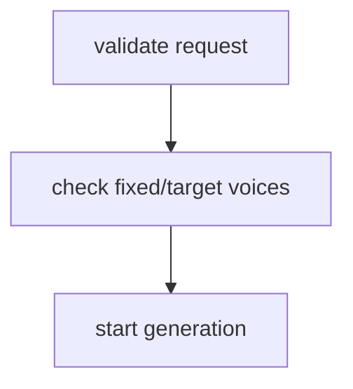
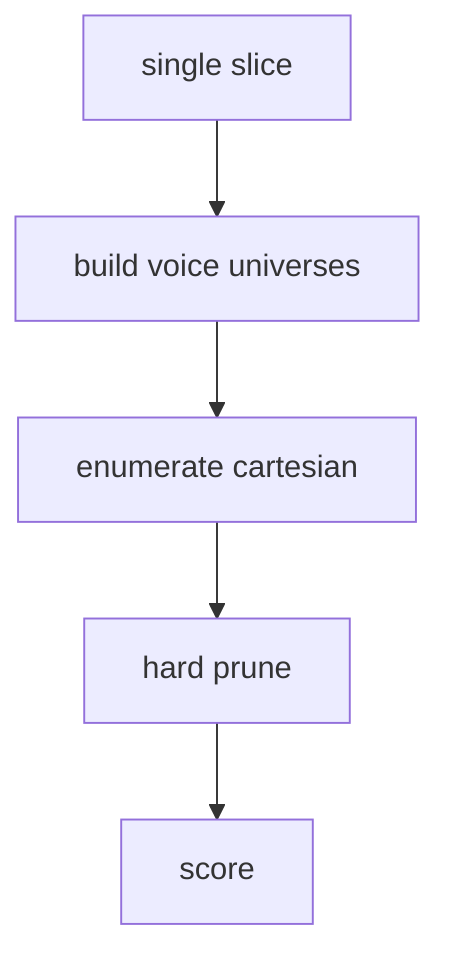
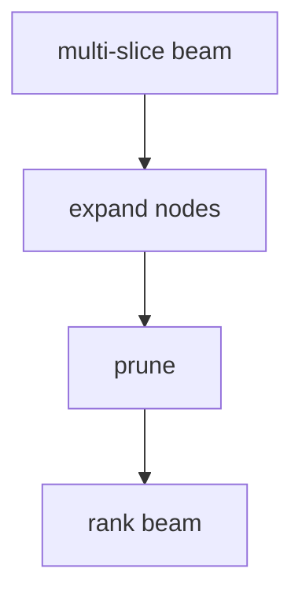
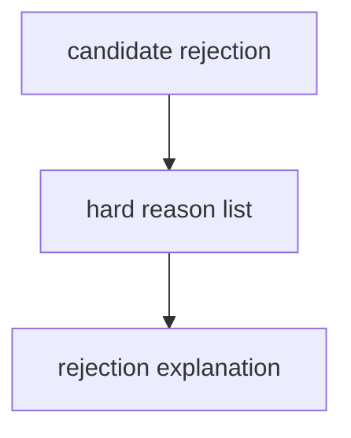
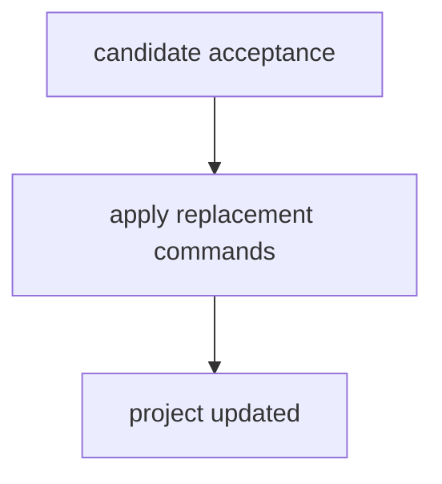
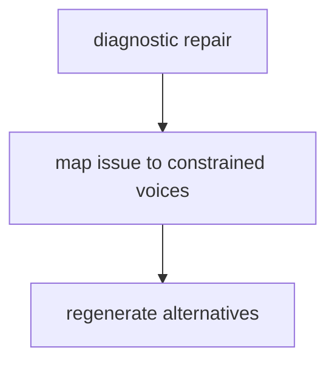
## Business process
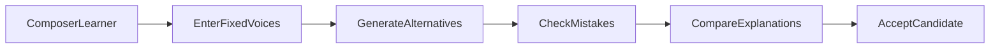
## DFDs
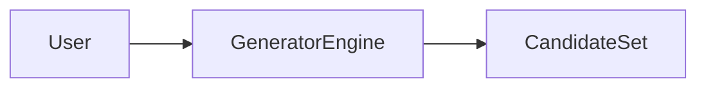
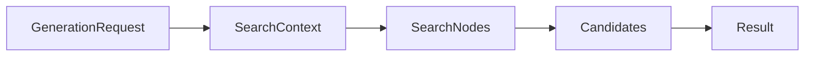
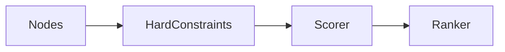
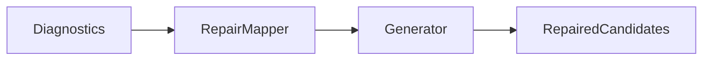
## Dataflow architecture
`GenerationRequest -> SearchContext -> SearchNode -> CandidateDraft -> GenerationCandidate -> GenerationResult`.

## Visualization surfaces
Candidate comparison table, score-breakdown table, hard/soft badges, telemetry panel, rejection histogram, motion arrows, and 31-EDO pitch-space labels.

## Process charts
- pitch universe: range defaults + fixed event preservation.
- hard pruning: range/crossing/spacing first.
- soft scoring: spacing + completeness baseline.
- ranking: total score then deterministic id tie-break.
- explanation: beginner + technical strings.
- apply candidate: command-based replacement in state.

## Sequence diagram
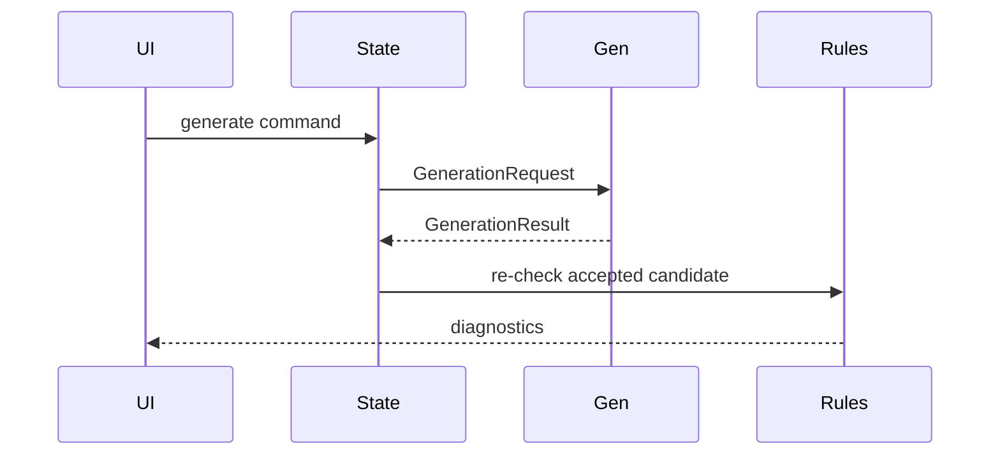
## Generation job state machine
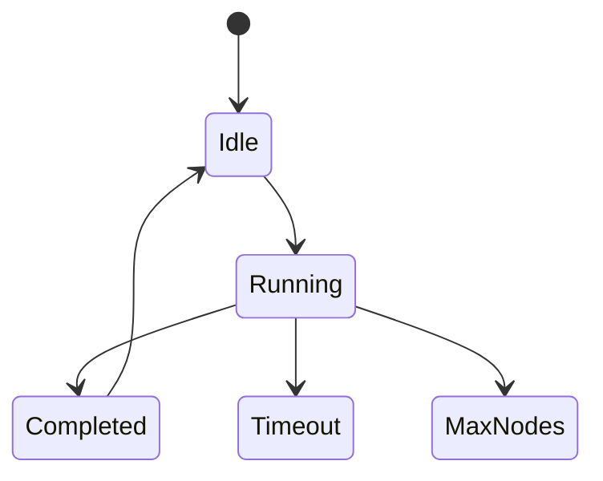
## ER diagram
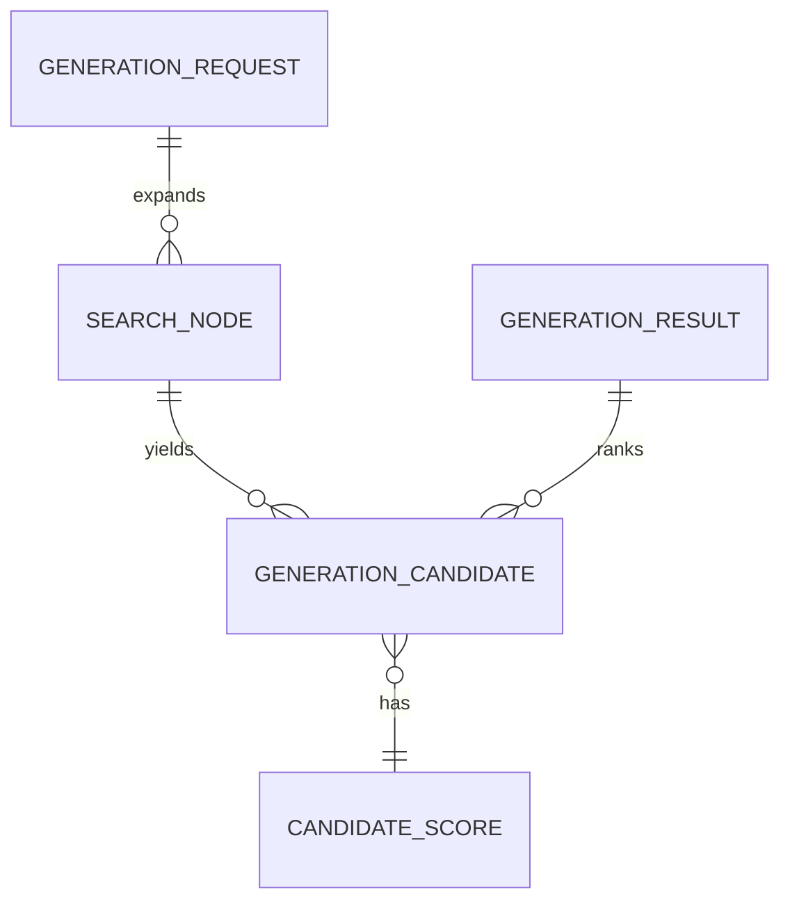

## Algorithm cards (concise)
- `generateFourVoiceHarmony`: validate request, enumerate voice combinations, prune hard constraints, score, rank, return status.
- `buildPitchUniverseForVoice` (implemented inline defaults): fixed event or range-based pitch choices.
- `enumerateVerticalAssignments`: cartesian loops SATB.
- `pruneHardConstraints`: range/crossing/spacing rejection reasons.
- `scoreCandidate`: spacing/completeness soft score.
- `beamSearchSlices`: planned; current implementation single-slice exhaustive with maxNodes/timeout safeguards.
- `rankCandidates`: score asc + id tie-break.
- `explainCandidate`/`explainRejection`: beginner+technical text and explicit reasons.
- `deterministicTieBreak`: lexical candidate id.

## OSS reuse matrix
- music21 (BSD): search/test idea study only.
- Tonal.js (MIT): functional API inspiration only.
- MuseScore/LilyPond (GPL): UX references only; no source use.
- VexFlow/OSMD/Verovio: adapter boundary references only.
- Tone.js: audio integration boundary reference.

## Quality strategy
Deterministic seed metadata, no hidden randomization, strict hard constraints before scoring, no fixed-event mutation, explicit no-solution reasons.

## Risk register
- Combinatorial explosion (mitigate maxNodes, timeout, future beam search).
- Style overreach (mitigate awaiting-style-rule-pack placeholders).
- 31-EDO spelling collapse risk (mitigate spelled pitch object preservation tests).

## Traceability matrix
- Contracts: `src/generator/*.ts`
- Hard constraints: `src/generator/constraints/hardConstraints.ts`
- Scoring: `src/generator/scoring/scoreCandidate.ts`
- Search: `src/generator/search/generateFourVoiceHarmony.ts`
- Explanations: `src/generator/explain/explainCandidate.ts`
- Tests: `src/test/generator-search.test.ts`

## Next tasks
1. Implement true multi-slice beam search module.
2. Add diagnostic-driven repair mapper.
3. Integrate rule-engine penalties into `diagnosticsPenalty`.
4. Add worker cancellation token interface.

## Command checklist
- `npm run typecheck`
- `npm run lint`
- `npm test`
- `npm run build`

## Final verification
- [x] Ranked candidates generated for simple fixtures.
- [x] Hard constraints enforced before soft scoring.
- [x] Deterministic behavior and tie-break.
- [x] Explicit no-solution/max-nodes statuses.
- [x] Requested generator documentation created.
