# Full Codebase Structure and Algorithms

## Full File Tree
- `src/domain/*` pure 31-EDO domain models.
- `src/theory/*` analysis helpers.
- `src/rules/*` plugin rule checker.
- `src/generator/*` deterministic candidate generator.
- `src/state/*` Zustand app state and commands.
- `src/ui/*` React scaffold panels.
- `src/audio/*`, `src/persistence/*`, `src/importExport/*` adapters.
- `src/test/*` unit/integration invariants.

## File-by-file Analysis
- `src/domain/pitch/pitch31.ts`: parse/format and 31-step mapping.
- `src/domain/interval/interval31.ts`: generic/chromatic spelling-aware interval.
- `src/domain/duration/rational.ts`: rational arithmetic and normalization.
- `src/domain/score/score.ts`: score/project document model.
- `src/rules/core/*`: rule plugin contracts and deterministic analyzer.
- `src/rules/builtin/basic.ts`: built-ins and placeholders (`awaiting-*`).
- `src/generator/core.ts`: deterministic ranked candidate output.

## Algorithm Cards
- `parsePitch31`: parse token to letter/accidental/octave; O(n); rejects invalid letter.
- `pitchClassStep31`: base letter step + accidental steps mod 31.
- `absoluteStep31`: octave*31 + class step.
- `frequencyOfPitch31`: `f = ref * 2^((abs-refStep)/31)`.
- `intervalBetweenPitches31`: absolute step subtraction.
- `genericInterval`: letter distance + octave.
- `normalizeRational/add/sub/cmp`: canonical duration math.
- `analyzeProject`: run ordered rules and aggregate diagnostics.
- `generateFourVoiceFromFixedInput`: deterministic candidate list.

## Diagrams
### Architecture dependency graph
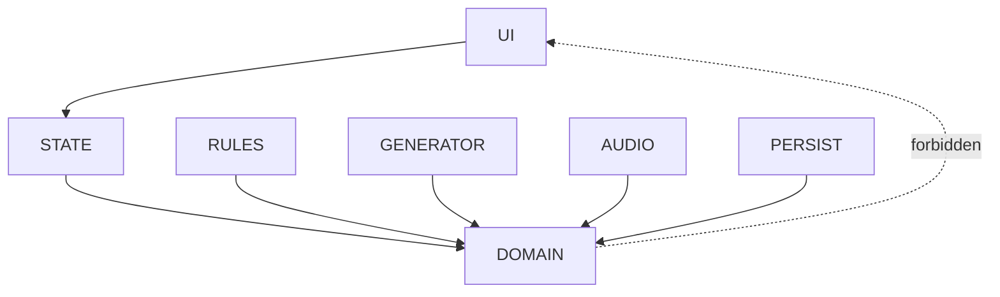

### C4 Context/Container/Component
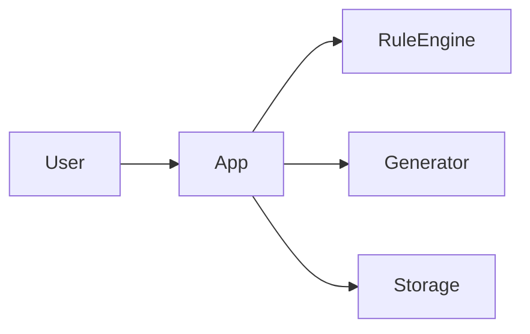

### Functional block diagram
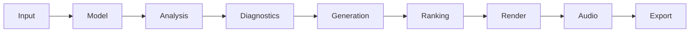

### Note entry sequence
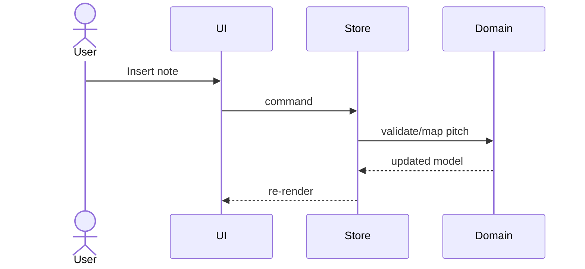

### Analysis activity
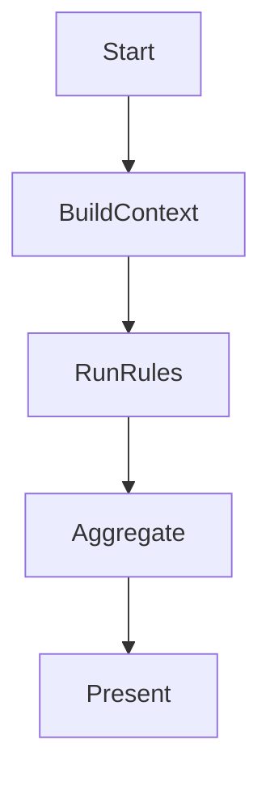

### Generator activity
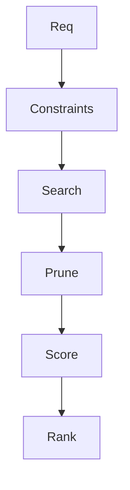

### DFD
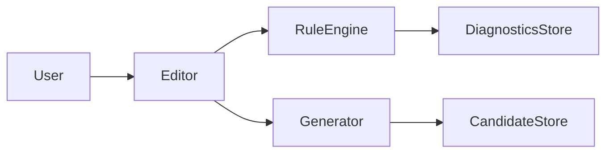

### Command/history state machine
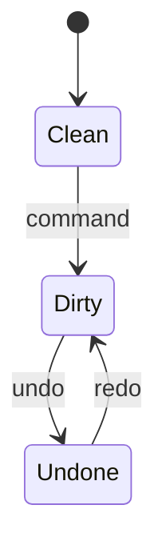

### ER diagram
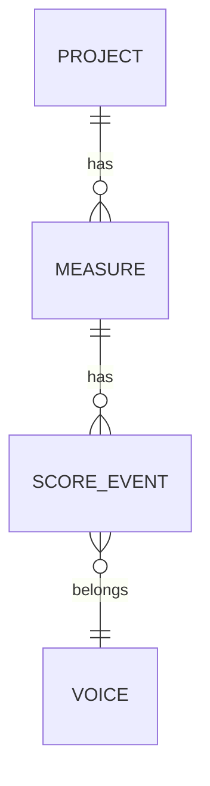

### Audio scheduling flow
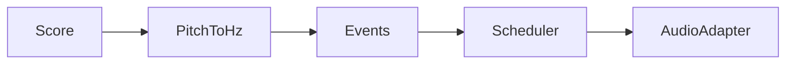

### Import/export flow
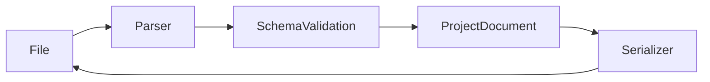

### Business process map
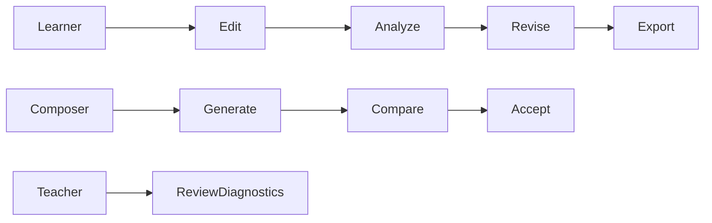

## OSS License/Reuse Matrix
- Tone.js (MIT): scheduling concepts only.
- VexFlow (MIT): adapter boundary only.
- Tonal.js (MIT): API style inspiration only.
- music21 (BSD): theory/test concept study only.
- MuseScore/LilyPond (GPL): UX study only, no code copying.

## Test/Quality Report
- Unit tests: pitch mapping, interval logic, rational arithmetic.
- Integration tests: deterministic rules, deterministic generator.
- Quality gates: `npm run typecheck`, `npm run lint`, `npm test`, `npm run build`.

## Verification Checklist
- [x] App scaffold runnable.
- [x] Domain independent from React/DOM adapters.
- [x] 31-EDO invariants tested.
- [x] Deterministic rule/generator checks.
- [x] Diagrams and reuse policy documented.
