# Rule Checker, Counterpoint, Harmony, and Voice-Leading Engine

## File Tree
- `src/domain/pitch/*`, `src/domain/interval/interval31.ts`, `src/domain/duration/rational.ts`, `src/domain/score/score.ts`
- `src/theory/sonority/slices.ts`
- `src/rules/core/{types.ts,engine.ts}`
- `src/rules/builtin/basic.ts`
- `src/test/rules-all.test.ts`

## File-by-file analysis
- Pure domain/theory/rules modules avoid React/DOM/audio imports.
- `basic.ts` defines 21 rules with metadata: id/version/severity/category/hard/status.

## Functional block diagram
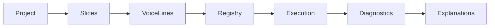
## Functional flow block diagram
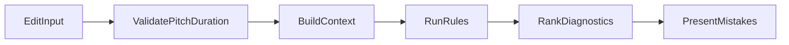
## Activity diagrams
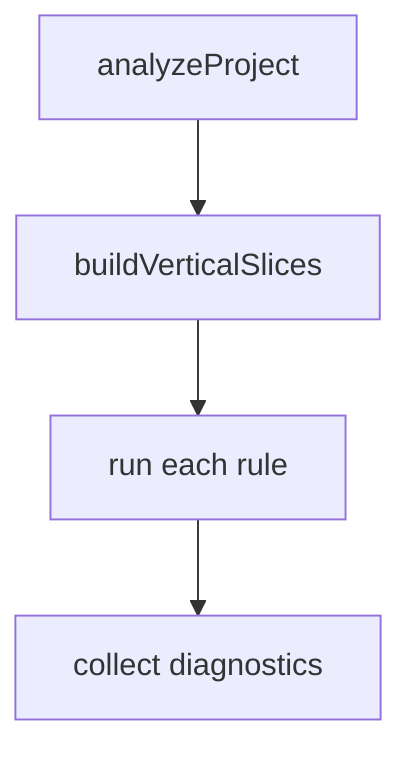
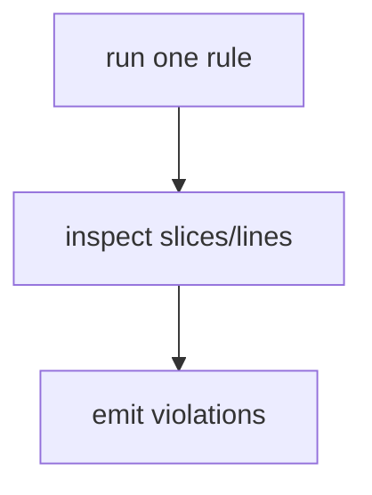
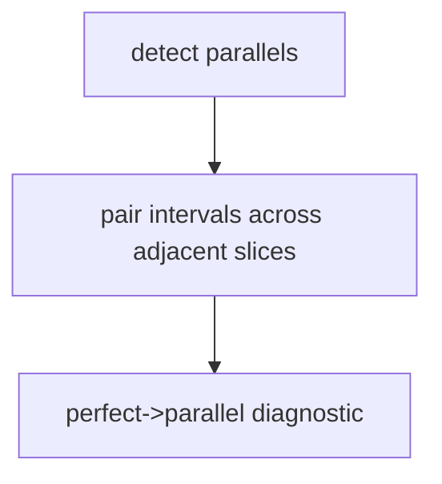
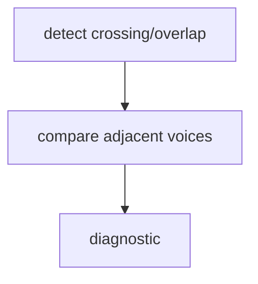
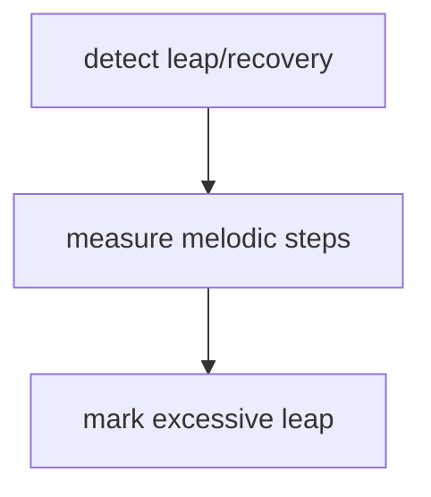
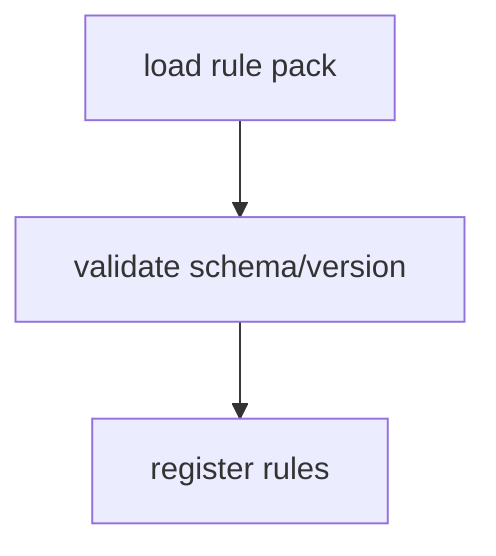
## Business process map
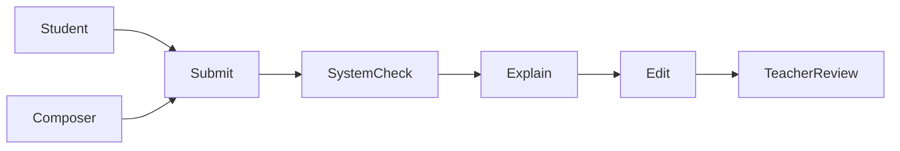
## DFDs
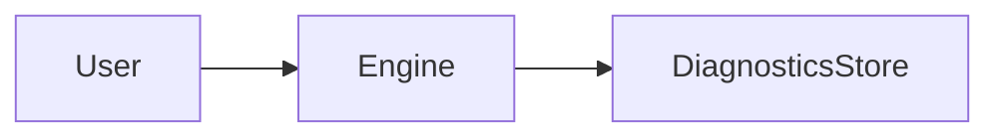
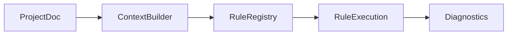
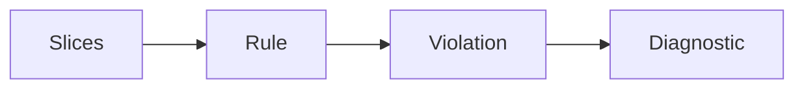
## Dataflow architecture
`ProjectDocument -> VerticalSlice[] -> RuleContext -> RuleResult -> Diagnostic[]`.

## Visualization
Severity map, category histogram, voice-line timeline, sonority table, and heatmap are supported by diagnostic fields (severity/category/locations/evidence).

## Flow process charts
- Parallel detection: slice-pair interval comparison.
- Crossing detection: soprano/alto, alto/tenor, tenor/bass ordering checks.
- Melodic detection: voice-line directed interval threshold checks.
- Diagnostic creation: map violation to beginner+technical explanations.
- Rule pack loading: versioned metadata, sourceStatus propagation.

## Package/file block diagram
```mermaid
graph TD
 D[src/domain]-->T[src/theory/sonority]
 T-->R[src/rules/core]
 R-->B[src/rules/builtin]
 B-->DIAG[Diagnostic[]]
```
## Sequence diagram
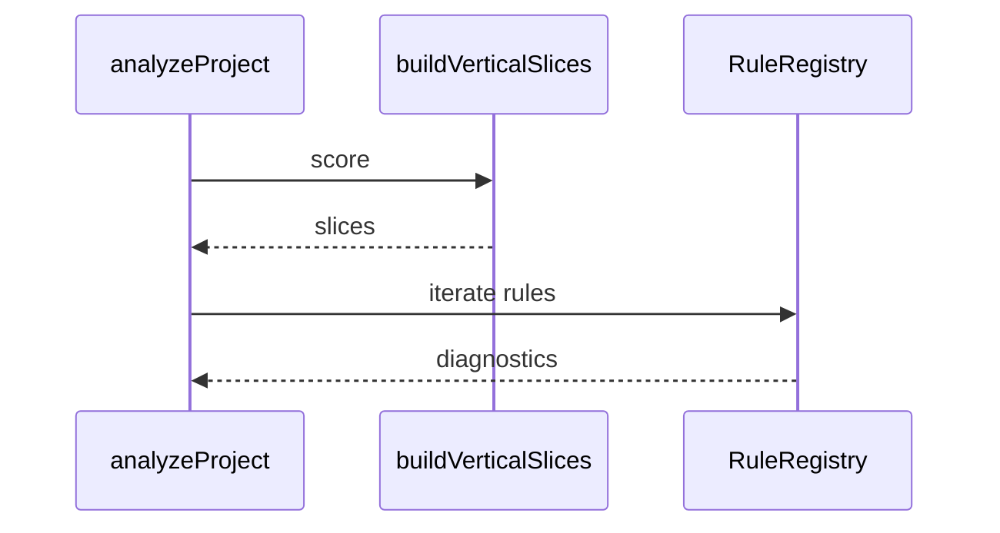
## Diagnostic lifecycle
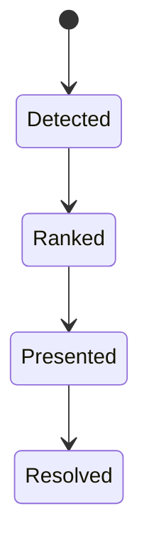
## ER diagram
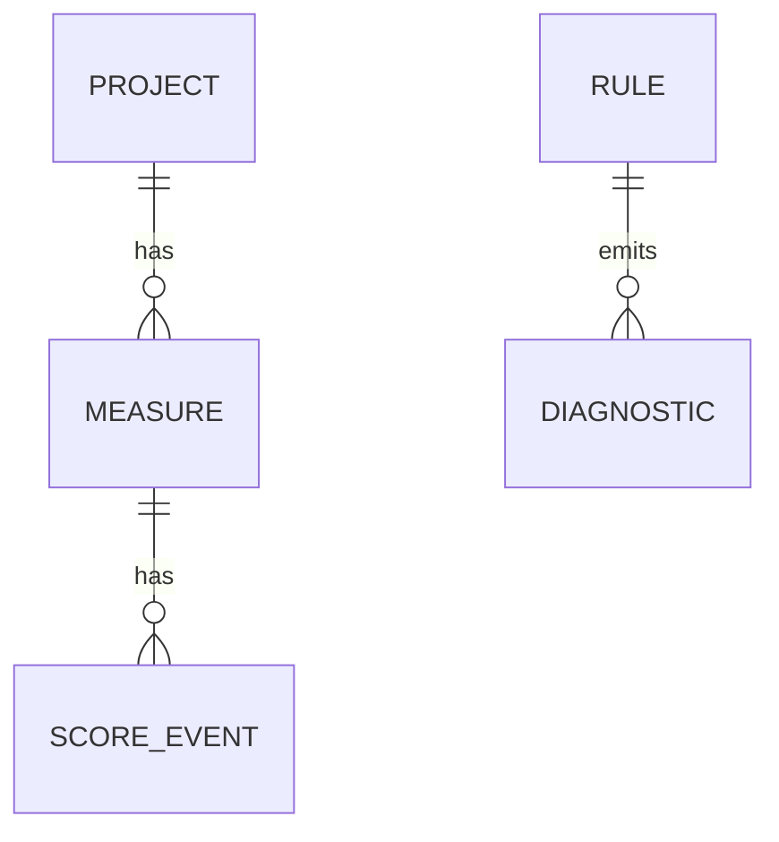

## Rule cards (summary)
All rules provide intent/rationale/31-EDO interpretation via beginner+technical explanations and `sourceStatus`.
Implemented now: range, tessitura, crossing, spacing, melodic leap.
Provisional no-op: overlap/parallels/hidden/leap-recovery/repeated-note/tendency.
Awaiting style pack placeholders: leading-tone, chordal-seventh, suspension, false relation, dissonance, cadence, chord spelling.

## OSS matrix
Studied concepts only: music21 (BSD), Tonal.js (MIT), MuseScore/LilyPond UX (GPL study-only). No source copied.

## Quality/risk
- Deterministic outputs enforced by stable sorting.
- Risks: stylistic overreach without sourced rule packs (mitigated by placeholders).

## Traceability
- Detection logic: `src/rules/builtin/basic.ts`
- Context pipeline: `src/theory/sonority/slices.ts`, `src/rules/core/engine.ts`
- Contracts: `src/rules/core/types.ts`
- Tests: `src/test/rules-all.test.ts`

## Command checklist
- `npm run typecheck`
- `npm run lint`
- `npm test`
- `npm run build`

## Final checklist
- [x] Deterministic analysis engine.
- [x] Pure TypeScript rule modules.
- [x] Diagnostics include beginner+technical explanations.
- [x] Placeholders marked awaiting-style-rule-pack.
- [x] Documentation includes requested diagram families.
